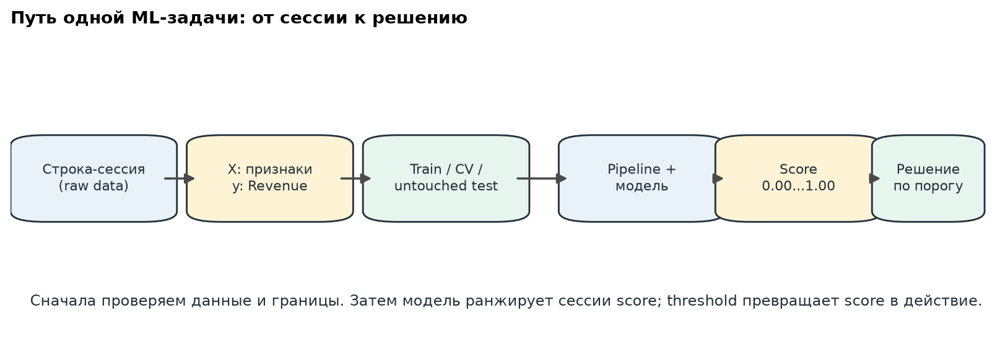
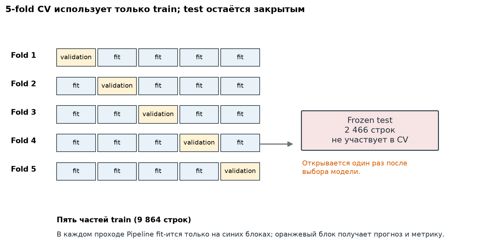
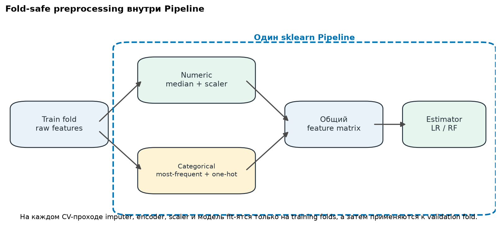
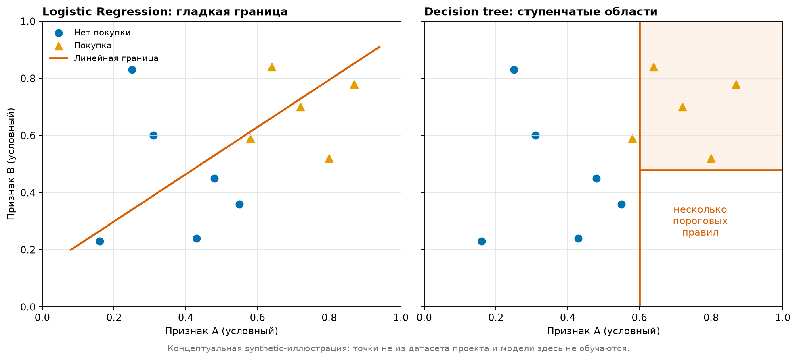
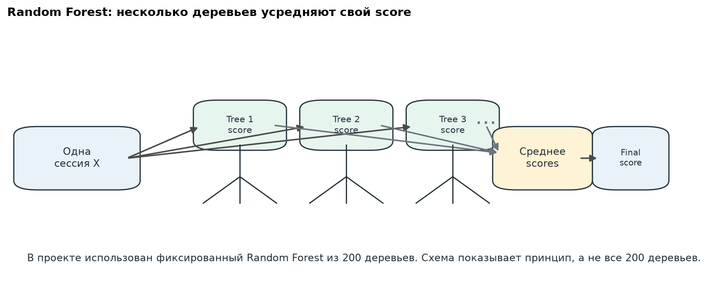
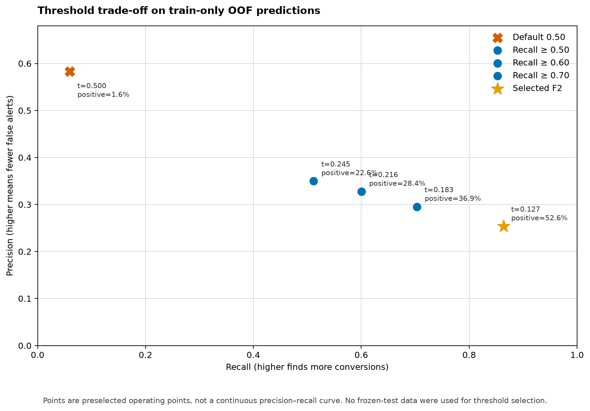

# Classical ML на примере prediction конверсии

Этот документ объясняет логику проекта без предположения, что вы уже работали с classical ML. Здесь **не** появляется новый результат: все числа и решения взяты из уже принятых отчётов.

## 1. Что именно предсказывает модель

Одна строка датасета — одна сессия посетителя сайта. У каждой сессии есть:

- `X` (features, признаки): например, число просмотренных product pages, месяц, тип посетителя, browser;
- `y` (target, целевая переменная): `Revenue` — закончилась ли сессия покупкой.

Это задача **binary classification**: ответ имеет два класса — `FALSE` и `TRUE`. Положительный класс (positive class) — `Revenue=TRUE`, то есть покупка. В исходных 12 330 сессиях покупок лишь 1 908, около 15.5%. Поэтому это не задача «угадать чаще всего», а задача поднять потенциальных покупателей выше в списке.

## 2. Весь путь данных

```text
raw rows
  -> audit: schema, target, leakage, duplicates
  -> frozen group-safe train/test split
  -> fold-safe Pipeline (preprocessing + model)
  -> train-only 5-fold CV and model selection
  -> one final fit on train + one untouched test evaluation
  -> train-only OOF threshold analysis
```

Это порядок не ради бюрократии. Он отделяет выбор решения от честной проверки: сначала мы учимся и выбираем модель на train, а test держим как независимую контрольную работу.



*Схема показывает роли этапов: модель сначала выдаёт score, а уже затем порог превращает его в решение.*

## 3. Train, validation и test

После заморозки split у нас было 9 864 train-строки и 2 466 test-строк. Test не участвовал в подборе модели.

Внутри train применили **5-fold cross-validation (CV)**. Train делится на пять частей: на каждом проходе четыре части используются для обучения (fit), а пятая — для проверки (score). Так каждая train-строка ровно один раз становится validation-строкой. Мы получаем пять значений метрики и смотрим их среднее и разброс, а не доверяем одной случайной разбивке.

Почему test нельзя смотреть много раз? Если после каждого взгляда менять модель, признаки или порог, решения постепенно подстраиваются под этот test. Он перестаёт быть независимым, даже если код формально не обучался на его строках. В этом кейсе test уже использован один раз; для новой финальной оценки улучшенной модели нужна новая независимая граница — например, внешний датасет.



*Оранжевый блок в каждой строке — validation fold; 2 466 test-строк не входят в эти пять проходов.*

## 4. Leakage: как модель может «подглядывать»

**Leakage** — это признак, который содержит информацию из будущего относительно момента предсказания. Тогда offline-метрика выглядит отлично, но в реальности моделью нельзя пользоваться.

В нашем случае `Revenue` — сам ответ, поэтому его нельзя передавать в `X`. `PageValues` тоже исключён: это transaction-conditioned аналитический показатель, связанный с ценностью страниц до завершения покупки. Он слишком близок к уже случившемуся исходу для честного in-session прогноза.

Есть и leakage через дубликаты. Если одинаковый профиль признаков попадёт и в train, и в test, модель может встретить почти готовый ответ. Поэтому feature-identical группы держали целиком на одной стороне split. Это и есть **group-safe** ограничение. Всё равно важно помнить ограничение данных: полные session aggregates не доказывают, что модель годится для раннего или real-time предсказания.

## 5. Preprocessing и Pipeline

Модели работают с числами, поэтому исходные колонки надо подготовить.

- Девять numeric-признаков: пропуск заменяется медианой, затем применяется `StandardScaler`.
- Семь categorical-признаков: пропуск заменяется самым частым значением, затем `OneHotEncoder` превращает категорию, например месяц, в набор 0/1-колонок.

Всё это вместе с моделью лежит внутри `sklearn.pipeline.Pipeline`. При каждом CV-проходе imputer, scaler и encoder **fit** только на четырёх обучающих folds, а затем применяются к пятому. Иначе, например, среднее и список категорий незаметно получили бы сведения из validation-fold.

Random Forest масштабирование почти не нужно: деревья сравнивают значения с порогами, а не расстояния между ними. Но единый Pipeline сохраняет честную одинаковую обработку для сравнения с Logistic Regression и не даёт preprocessing leakage.



*Пунктирная рамка важна: preprocessing — часть обучения, а не отдельная подготовка на всём датасете.*

## 6. С чего начали и какие алгоритмы сравнили

**DummyClassifier** ничего не изучает: он выдаёт prior, то есть базовую долю покупок. Это нижняя полезная точка отсчёта. Его CV AP = **0.155**.

**Logistic Regression** учит вес каждого преобразованного признака и складывает их в линейный score. Грубо: одни признаки подталкивают score вверх, другие вниз. Это простой, быстрый и хорошо проверяемый baseline. Его CV AP = **0.331**.

**Random Forest** — много decision trees. Каждое дерево обучается на случайной bootstrap-выборке строк и на случайных подмножествах признаков в разбиениях; затем лес усредняет scores деревьев. Деревья могут выразить нелинейные зависимости и взаимодействия: например, комбинация типа посетителя и поведения может иметь иной смысл, чем каждый признак отдельно. Фиксированный лес из 200 деревьев с `min_samples_leaf=2` достиг CV AP = **0.379**, поэтому прошёл заранее заданный порог улучшения над Logistic Regression.

Это не доказывает причинность и не говорит, какой feature «вызвал» покупку. Мы также не делали feature-importance выводов в этом кейсе.



*Это synthetic-рисунок для интуиции, а не визуализация данных проекта и не результат нового обучения.*



*В нашем фиксированном кандидате 200 деревьев; на схеме показаны только несколько, чтобы увидеть принцип усреднения.*

## 7. CV, группы и OOF простыми словами

В одном CV-проходе модель делает:

```text
fit Pipeline on folds 0,1,2,3 -> predict scores for fold 4 -> compute AP
```

Потом роль validation-fold переходит к каждой из остальных частей. Группы одинаковых allowed-feature значений не разрываются между обучением и проверкой. Поэтому CV mean — среднее пяти метрик, а CV std — их разброс между folds. Для RF это AP `0.379 ± 0.010`; небольшая величина std означает, что пять проверок дали близкие результаты, а не гарантию production-стабильности.

**OOF (out-of-fold) score** — прогноз для train-строки от модели, которая не училась на этой строке: каждый OOF score приходит из её validation-fold. Если собрать OOF scores всех 9 864 строк, можно честно изучать порог на train без повторного открытия test.

## 8. Как измеряем качество

Когда score превращаем в ответ «покупка / не покупка», получаем confusion matrix:

| Реальность / решение | Предсказали покупку | Предсказали нет |
| --- | ---: | ---: |
| Покупка | TP | FN |
| Нет покупки | FP | TN |

`TP` — найденная покупка, `FP` — ложное срабатывание, `FN` — пропущенная покупка, `TN` — верный отказ. Обычная accuracy здесь ловушка: ответ «нет покупки» всегда дал бы примерно 84.5% accuracy, но не нашёл бы ни одной покупки.

Главная метрика — **Average Precision (AP)**. Она оценивает ranking: насколько покупатели концентрируются среди строк с высоким score. Интуитивно AP суммирует precision в точках, где мы находим очередного настоящего покупателя. Чем выше, тем лучше; базовая доля покупок здесь около 0.155. Результаты: dummy `0.155`, Logistic Regression CV `0.331`, RF CV `0.379`, один final holdout RF `0.368`.

Вторичная метрика — **ROC-AUC**: вероятность, что случайная покупка получит score выше случайной непокупки. У финального holdout она `0.778` (случайное ранжирование — `0.5`). AP важнее для редкого positive class, ROC-AUC полезна как дополнительная проверка ранжирования.

Для конкретного порога считаем:

```text
precision = TP / (TP + FP)       recall = TP / (TP + FN)
F1 = 2 * precision * recall / (precision + recall)
F2 сильнее ценит recall, чем precision.
```

## 9. Score, probability и threshold

`predict_proba` возвращает score положительного класса, а `predict` обычно превращает его в класс порогом `0.5`: score >= 0.5 означает «покупка». Это стандарт sklearn, не правило бизнеса.

На финальном test при 0.5 получили `TP=20`, `FP=19`, `FN=362`, `TN=2065`: precision `0.513`, но recall только `0.052`. Это не противоречит хорошему AP: модель может относительно правильно упорядочивать сессии, но очень редко выдавать score выше 0.5.

Scores Random Forest не обязаны быть **калиброванными вероятностями**: score `0.20` не гарантирует ровно 20% конверсии. В этом проекте calibration не делали. Вместо этого порог изучали только на train OOF:

| Train-only operating point | Порог | Precision | Recall | Отмечено сессий |
| --- | ---: | ---: | ---: | ---: |
| Иллюстративный F2 | 0.127 | 0.254 | 0.864 | 52.6% |
| Умеренный: recall >= 70% | 0.183 | 0.295 | 0.703 | 36.9% |

Низкий порог находит больше покупателей, но создаёт больше FP и больше действий для бизнеса. Высокий порог экономит действия, но пропускает покупки. Правильный выбор зависит от цены промо, capacity команды и ценности найденной конверсии; test для выбора порога не использовался.



*Это существующий график из train-only OOF анализа: он не использует final test для выбора порога.*

## 10. Что значит «обучить» и «предсказать» в коде

Для Logistic Regression обучение подбирает веса линейной функции. Для Random Forest обучение строит правила ветвлений многих деревьев. В обоих случаях `fit(X_train, y_train)` учится на известных исходах, а `predict_proba(X_new)` возвращает score для новой сессии.

Минимальная схема проекта выглядит так (это иллюстрация, не готовый runnable script):

```python
pipeline = Pipeline([("prep", column_transformer), ("model", random_forest)])
pipeline.fit(X_train, y_train)
score = pipeline.predict_proba(X_test)[:, 1]
decision = score >= threshold
ap = average_precision_score(y_test, score)
```

Ключевой момент: в CV создаётся новый Pipeline для каждого fold, а `threshold` выбирается по OOF train scores, не по `X_test`.

## 11. Как читать наш результат

Смотрите на три разных вопроса:

1. **Ranking quality:** RF заметно лучше dummy по AP (`0.368` holdout против `0.155`) и имеет ROC-AUC `0.778`.
2. **Operating point:** default 0.5 почти никого не отмечает; выбранный business threshold изменит precision/recall trade-off.
3. **Generalization:** CV AP `0.379` и один holdout AP `0.368` близки, поэтому нет явного сигнала сильного переобучения. Но один holdout не доказывает production quality.

Итог: это полезный сигнал умеренной силы для offline ranking benchmark, а не готовая production-система или доказательство причинного эффекта.

## 12. Частые ошибки новичка

- Считать accuracy главной метрикой при редком positive class.
- Fit-ить scaler/encoder на всём датасете до CV.
- Подбирать модель, признаки или порог по test.
- Оставлять outcome-conditioned поле среди features.
- Игнорировать дубликаты и связанные группы при split.
- Называть raw model score «вероятностью» без проверки calibration.
- Делать вывод о бизнес-ценности без стоимости FP/FN и без проверки feature availability во времени.

## Короткий словарь

- **Feature / X** — входной признак сессии.
- **Target / y** — ответ, который хотим предсказать.
- **Fit** — обучение параметров preprocessing или модели на данных.
- **Score** — численный сигнал модели для positive class.
- **Threshold** — граница, превращающая score в решение.
- **Baseline** — простая точка сравнения.
- **CV / fold** — повторяемая проверка на нескольких train/validation частях.
- **OOF** — prediction для строки моделью, не обучавшейся на этой строке.
- **Leakage** — информация из будущего или из validation/test, попавшая в обучение.
- **Calibration** — проверка, соответствует ли score реальной частоте события.

## Как изучать репозиторий

1. [README](../README.md) и [portfolio case study](portfolio_case_study.md) — короткая картина кейса.
2. [Dataset and leakage audit](../reports/online_shoppers_dataset_audit.md) — откуда данные, target и почему исключён `PageValues`.
3. [Frozen split protocol](../reports/online_shoppers_split_protocol.md) — train/test и group-safe CV.
4. [Baseline](../reports/online_shoppers_baseline.md) — Dummy и Logistic Regression.
5. [Model comparison](../reports/online_shoppers_model_comparison.md) — почему выбран RF.
6. [Final evaluation](../reports/online_shoppers_final_evaluation.md) — единственный результат на holdout.
7. [Threshold analysis](../reports/online_shoppers_threshold_analysis.md) — train-only OOF компромиссы порога.
