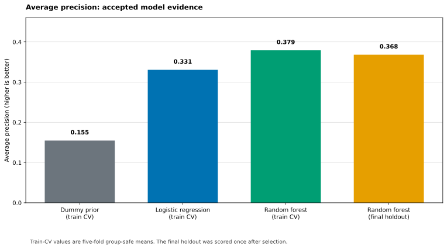
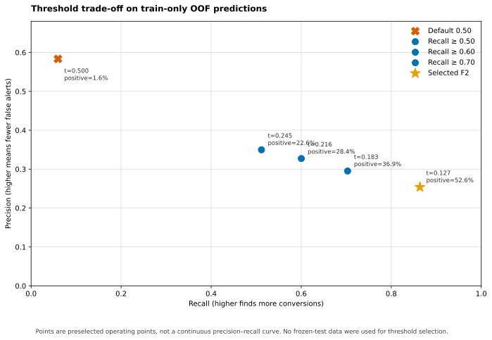

# Online Shoppers Conversion Prediction

## The problem

This case asks a practical product question: can session-level web analytics rank which sessions are likely to end in a purchase? The target is `Revenue=TRUE` in the UCI Online Shoppers Purchasing Intention Dataset. Purchases occur in 15.5% of 12,330 sessions, so the work emphasizes average precision rather than misleading raw accuracy.

The scope is intentionally narrow: an offline benchmark with full-session aggregates. It does not claim a production, real-time, or early-session conversion predictor.

## What I personally owned

I approved the dataset and target definition, set the leakage and frozen-split boundaries, selected the bounded model-comparison rule, and decided that the threshold should be examined only on train-only validation evidence. I also retained the constraint that the held-out test could be used once for final evaluation, not for tuning.

Bounded agents implemented approved tasks, ran focused checks, and produced evidence. They did not independently choose the dataset, model, operating policy, or final interpretation.

## Dataset and evaluation protocol

The UCI dataset is available under CC BY 4.0. The audit records 125 exact duplicate rows and excludes `PageValues`, an outcome-conditioned analytics feature. `Revenue` is the label, not a feature. Feature-identical groups remain isolated across a deterministic, stratified 80/20 split (seed `20260719`): 9,864 train and 2,466 test sessions.

All imputing, encoding, scaling, and estimation occur in sklearn Pipelines. Candidate selection used one fixed, group-safe five-fold CV protocol on training rows only. The final Random Forest was then fit once on all training data and evaluated once on the untouched holdout.

## From baseline to selected model

| Model | Average precision | Protocol |
| --- | ---: | --- |
| Dummy prior | 0.155 | five-fold train CV |
| Logistic Regression | 0.331 | five-fold train CV |
| Random Forest | 0.379 | five-fold train CV |
| Random Forest | 0.368 | single frozen holdout |

The fixed Random Forest (`200` trees, `min_samples_leaf=2`) improved AP by 0.049 over Logistic Regression in the accepted CV protocol, exceeding the predeclared +0.01 selection gate. Final holdout AP was 0.368 and ROC-AUC was 0.778. The holdout is a single estimate, so the close CV/holdout values support consistency but do not prove statistical significance.

## Threshold trade-off

The default estimator threshold of 0.5 has high precision but recalls only 5.2% of holdout conversions. This is not a failure of ranking by itself: a threshold converts a ranking score into a product action, and that action needs a cost-aware rule.

I therefore ran one separate, train-only OOF threshold analysis without calibration. Under an illustrative F2 objective that weights missed conversions more heavily, the selected threshold is 0.127: 86.4% recall, 25.4% precision, and 52.6% of sessions flagged. A more conservative recall-at-least-70% point is 0.183 with 29.5% precision and 36.9% flagged.

These are validation-only operating points. Raw Random Forest scores are not claimed to be calibrated probabilities, and the final test was not used to choose a threshold.

## Why evaluation discipline matters

The strongest result is not that a Random Forest wins one metric. It is the traceable decision: feature availability was checked before fitting, duplicate groups were kept out of cross-split leakage, preprocessing was fold-safe, model selection stayed on train CV, and the test was reserved for one final score.

That boundary matters for the next iteration. Better candidates can still be screened with the existing train-CV protocol, but a new independent external dataset or newly frozen evaluation boundary is needed for an unbiased final-performance claim.

## Failures and fixes

Two small engineering issues were kept visible. Windows line-ending conversion changed raw report bytes and therefore invalidated a recorded SHA-256; `.gitattributes` was added to preserve LF for hash-controlled files. The initial threshold scan had quadratic work; it was replaced with a deterministic cumulative-count implementation and parity-tested before the single OOF run. Neither fix changes the model, data, or final test result.

## Limitations and next steps

- Session aggregates do not prove that the necessary fields exist early enough for intervention.
- The benchmark does not establish causal uplift, online reliability, fairness, or a business cost function.
- Scores were not calibrated; threshold selection is an illustrative F2 policy, not a deployed policy.
- The frozen holdout has already been used once and must not be reopened for model selection.

The next planned phase is a separately bounded model-improvement study. It has not started. It would compare predeclared candidates only on the frozen training-CV protocol, then require a separate independent evaluation boundary before making a new final performance claim.
